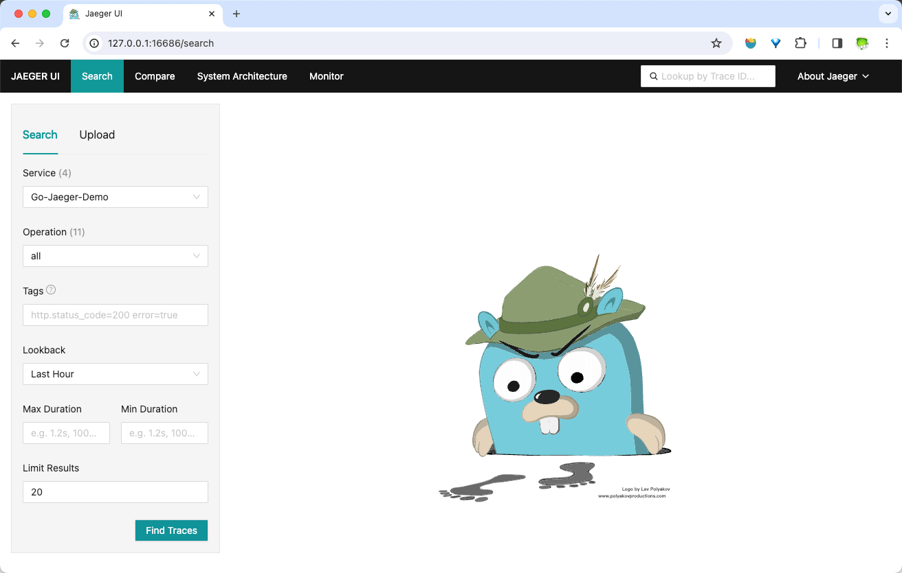
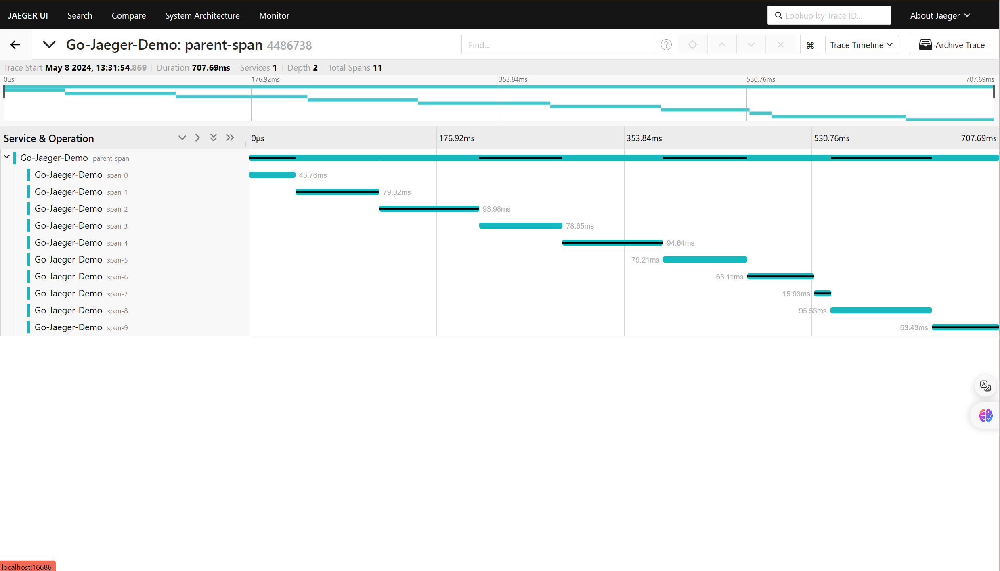

## Jaeger

### 什么是jaeger
**Jaeger** 是一个分布式追踪系统。Jaeger的灵感来自 Dapper 和 OpenZipkin，是一个由 Uber 创建并捐赠给 云原生计算基金会（CNCF） 的分布式跟踪平台。它可以用于监控基于微服务的分布式系统：
+ 分布式上下文传递
+ 分布式事务监听
+ 根因分析
+ 服务依赖性分析
+ 性能/延迟优化

Jaeger 项目主要是跟踪后端，它接收跟踪遥测数据，并对数据进行处理、汇总、数据挖掘和可视化。如需了解更多信息

### jaeger的作用
开发人员使用 Jaeger 以几种不同的方式提高分布式系统的性能。下面提供了一些示例。

+ **分布式事务监控**:Jaeger 具有监控微服务之间的数据移动的功能。开发人员可以在中断用户体验之前采取积极主动的方法来检测和解决问题。
+ **延迟优化**:Jaeger 分析可以定位微服务中降低应用程序速度的瓶颈。开发人员使用 Jaeger 来检查微服务的行为并寻找加快它们的方法。
+ **根本原因分析**:在微服务架构中，一个问题可能会导致其他问题。开发人员可以使用 Jaeger 找到应用程序中一系列相关问题的起点。
+ **服务依赖性分析**:服务依赖性意味着一个应用程序依赖于几个组件来运行。例如，导航应用程序依赖于移动应用程序上的定位服务。开发人员使用 Jaeger 来了解不同微服务之间的复杂关系。
+ **分布式上下文传播**:分布式上下文传播是应用程序与数据一起传递描述性信息的方式。这有助于开发人员从整体上评估微服务性能。例如，Jaeger 使用客户姓名标记订单请求，以便开发人员可以将请求路径与特定客户相关联。

### trace与span
一个 trace 代表了一个事务或者流程在（分布式）系统中的执行过程,一个 span 代表在分布式系统中完成的单个工作单元，也包含其他 span 的 “引用”，这允许将多个 spans 组合成一个完整的 Trace
    
**span包含的元信息**
+ span-id
+ 操作名
+ 开始时间和结束时间，以及耗时
+ tag，用户自定义标签便于查询过滤和理解数据
+ log，记录 Span 内特定时间或事件的日志信息，以及应用程序本身的其他调试或信息输出
+ span context，跨越进程边界，传递到子级 Span 的状态。常在追踪示意图中创建上下文时使用

### jaeger的工作原理
Jaeger 采用分布式跟踪的原则，并使用 OpenTracing 框架

#### 分布式跟踪
分布式跟踪是一种监控微服务之间事件序列的软件技术。它跟踪所有连接并提供图表以可视化应用程序中的请求路径。作为一种分布式跟踪工具，Jaeger 通过为每个请求分配一个唯一标识符并在特定服务处理请求时收集信息来跟踪请求移动

#### OpenTracing

OpenTracing 是一个开源或免费提供的框架，它提供了在现代软件系统中实现准确、交钥匙分布式跟踪的标准。例如，它提供了一个通用标准，用于定义在微服务之间传输的受监控信息的结构。Jaeger 使用 OpenTracing 提供完整的解决方案来收集、存储、管理、分析和可视化微服务数据。

#### OpenTracing 数据模型
OpenTracing 数据模型提供了连接来自不同组件的数据的基本定义。它使用的两个主要术语是跨度和跟踪。

###### 跨度
跨度是在分布式跟踪系统中完成的单个逻辑工作单元。每个跨度都包含以下组件：

+ 操作名称
+ 开始时间和停止时间
+ 帮助开发人员分析跨度的标签或值
+ 存储微服务生成的任何消息的日志
+ 跨度上下文或跨度的附加描述

###### 跟踪
跟踪是属于同一进程的一个或多个跨度的集合。它代表在特定时间发生的事件。属于同一跟踪的跨度共享相同的跟踪 ID。

